# **A Yen for the Future**
---

---
## **Background**
Large Companies, Banks, Hedge Funds and other Financial Institutions who have foreign currency exposure by nature of business or who have active exposure are always interested in anything that can provide them an edge in predicting currency movements. 

---
## **Objective**
To predict future movements of CAD/JPY using
* Time Series Forecasting Models
* Linear Regression Models

---
## **Steps**

* Time Series Analysis
1. Load the historical CAD/JPY rates into Pandas Data Frame
2. Using Hodrick Prescott Filter, identify the trend and noise components. Compare the Price vs Trend 
3. Check the data for Stationarity using Augmented Dickey Fuller Test. If not, transform the data 
4. Plot Autocorrelation Function and Partial Autocorrelation Function to identify the order of model 
5. Apply Auto Regressive Moving Average (ARMA) model and interpret the results. Forecast 5 days Price using ARMA Model.
6. Apply ARIMA Model, interpret the results and forecast 5 day future price using the model
7. After forecating future prices, now we focus on forecasting near term volatitity using GARCH Model. Interpret the results and forecast volatility.

* Linear Regression 
1. Load the historical CAD/JPY rates into Pandas Data Frame
2. Calculate Daily Returns and Lagged Daily Returns
3. Split the data into Train and Test set.
4. Apply Linear Regression Model from SKlearn library for Train period
5. Based on the model, predict the returns for the test preiod
6. Evaluate the in-sample and out-sample performance.

---
## **Technologies/Tools/Libraries**

1. Python
2. Pandas
3. Matplotlib
4. Pathlib
5. Statsmodel
6. ARCH
7. Sklearn
8. Jupyter Notebook
9. Numpy

---
## **Data**

Historical CAD/JPY price data starting from 1982 to 2020 stored in CSV file in Data Folder.
* [CAD/JPY Data](Data/cad_jpy.csv)

---
## **Code**
1. [Time Series Analysis](time_series_analysis.ipynb)
2. [Regression Analysis](regression_analysis.ipynb)

---
## **Output**

**Time Series Analysis**

1. CAD/JPY Historical Price Chart
   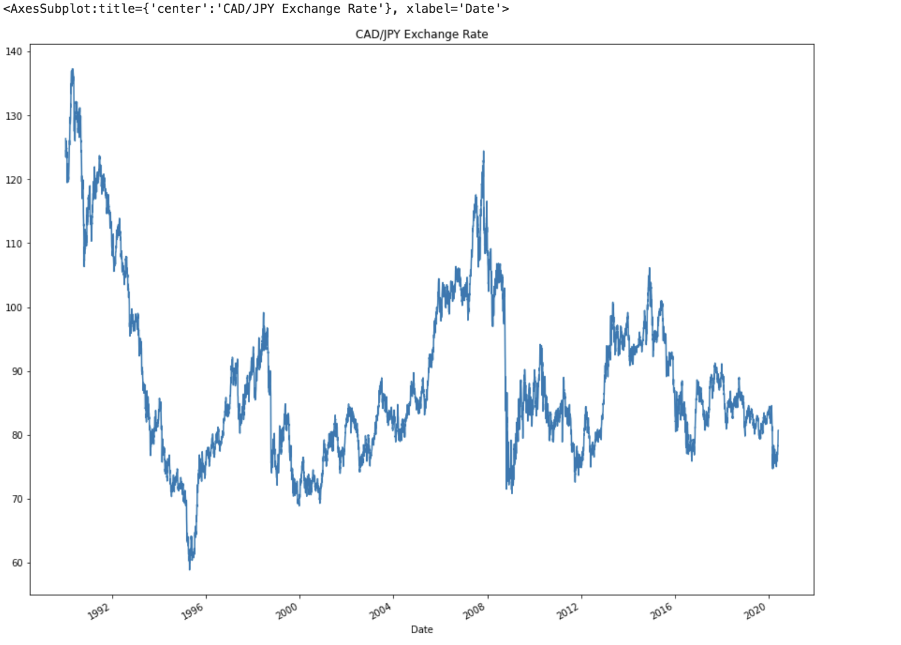
2. Hodrick Prescott Filter - Trend component
   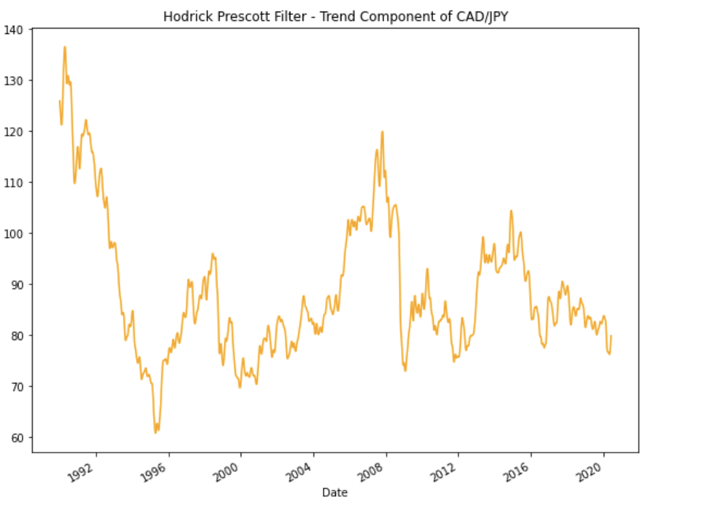
3. Hodrick Prescott Filter - Noise
   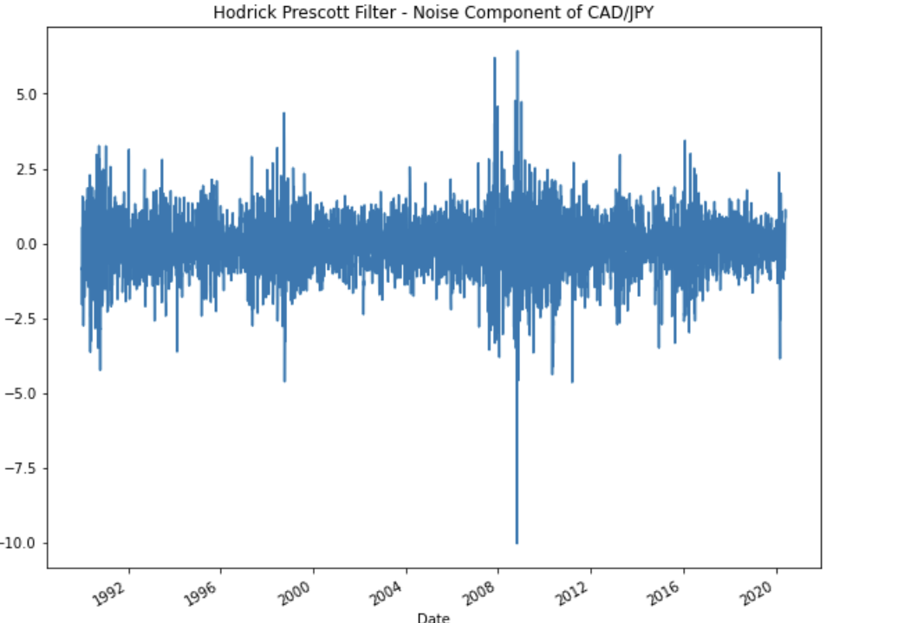
4. Price Vs Trend
   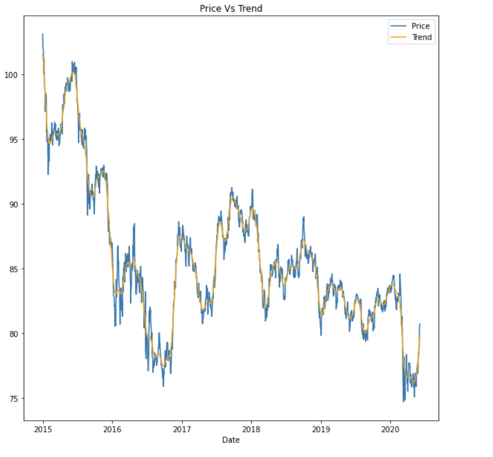
5. Autocorrelation Funtion & Partial Autocorrelation Function
   | Autocorrelation | Partial Autocorrelation |
   |---|---|
   |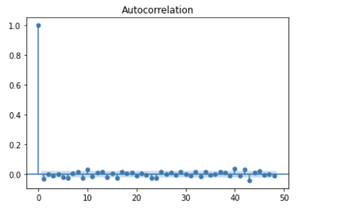|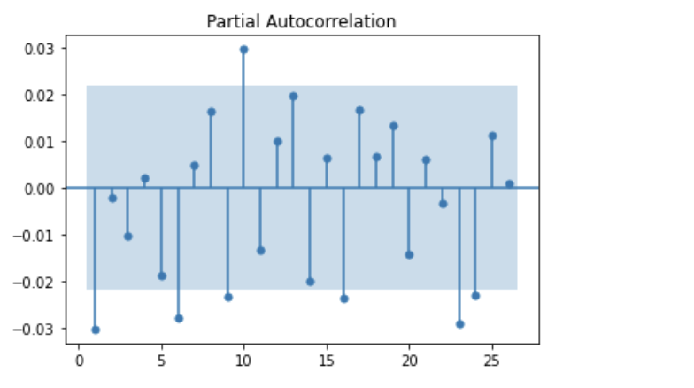|
6. ARMA Model of order (2,1)
   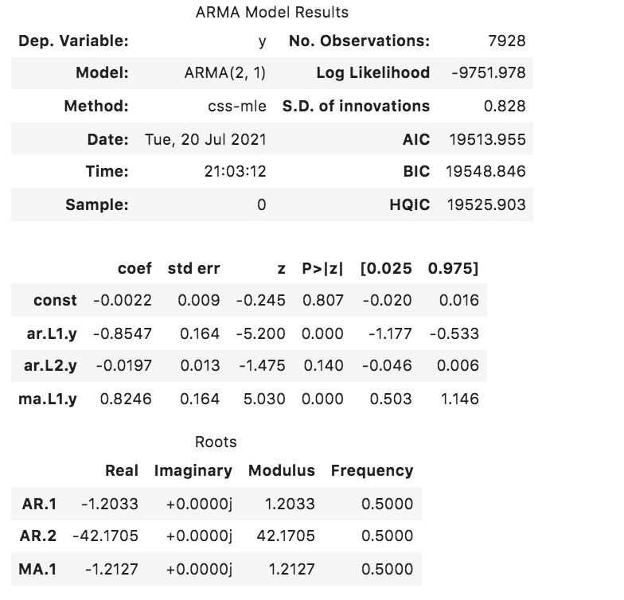
7. ARMA Model 5 Day Forecast
   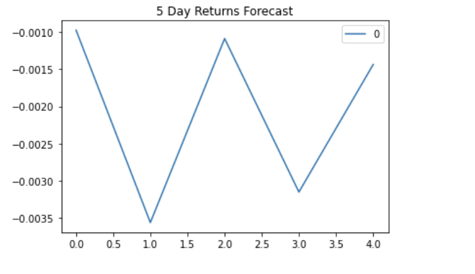
8. ARIMA Model Results
   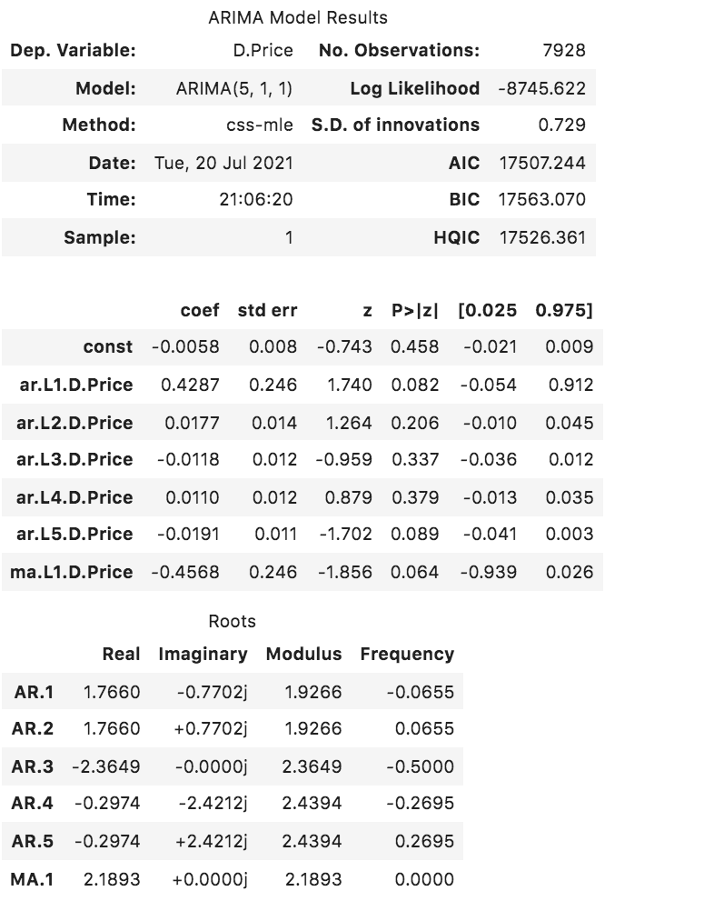
9. ARIMA Model 5 Day Price Forecast
    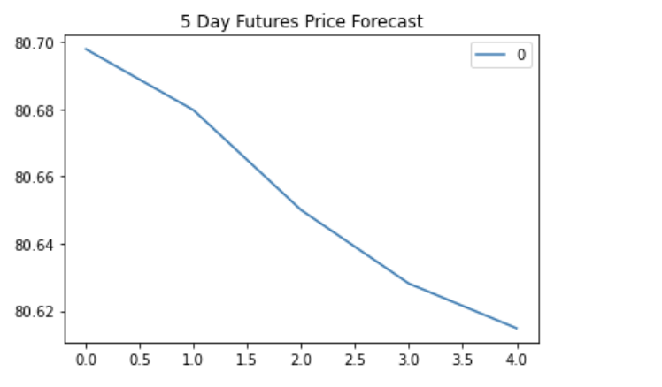
10. GARCH Model 
    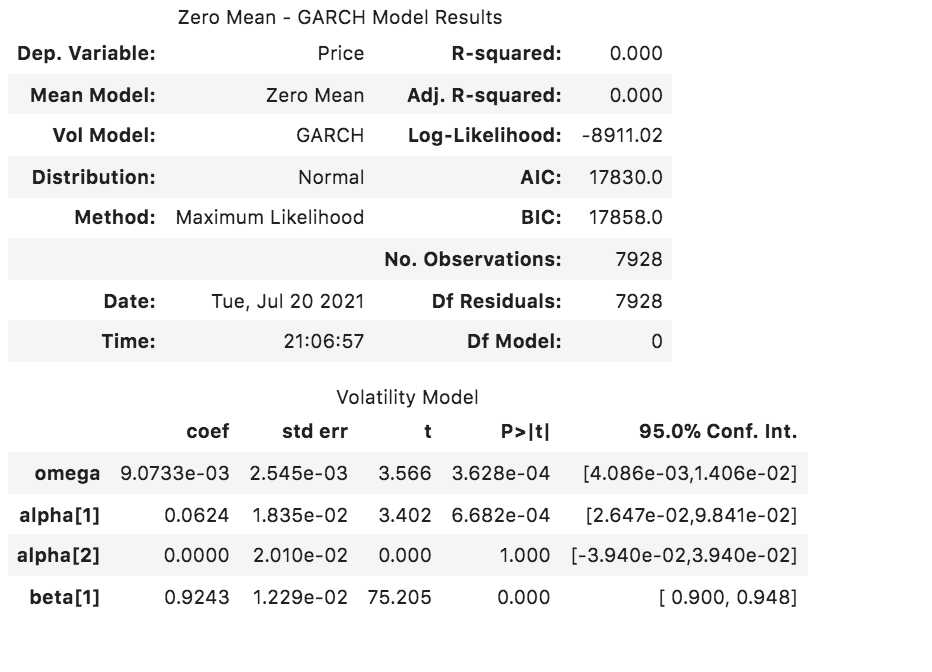
11. GARCH Model 5 Day Volatility Forecast
    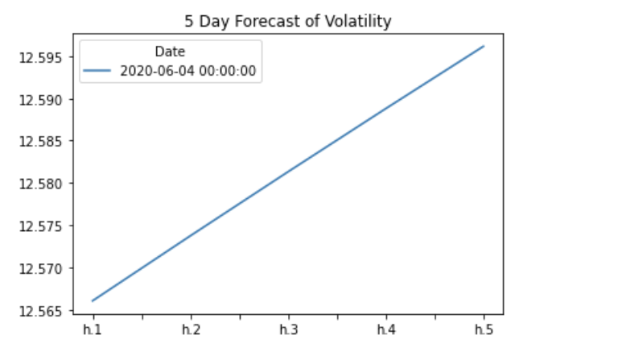

**Linear Regression **
1. Regression Predictions 
   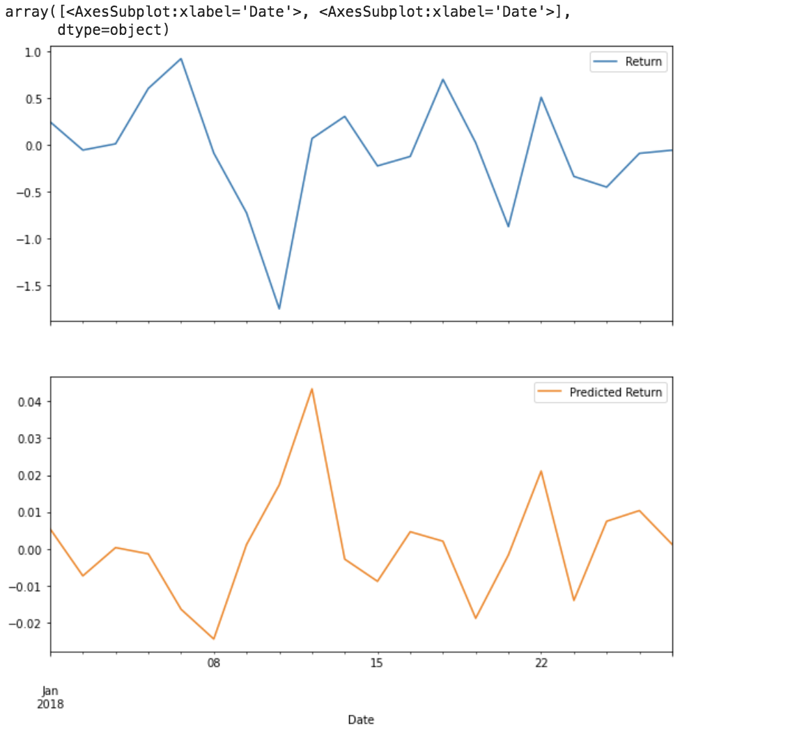
2. Out sample Root Mean Square Error
   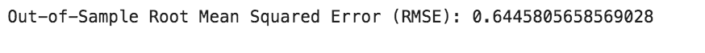
3. In Sample Root Mean Square Error
   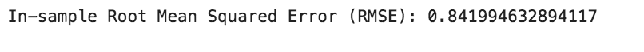

---

